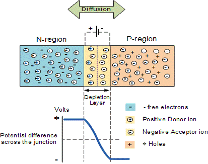

<h1 align="middle">VR Junction</h1>

This is the final project of the course INTRO TO VR.
 
_Supervisor:_ Dr. Evan Fakhoury

## Description

In this project, we will be covering the concept of PN junction. A P-N junction is an interface or a boundary between two semiconductor material types, namely the p-type and the n-type, inside a semiconductor. In a semiconductor, the P-N junction is created by the method of doping. The p-side or the positive side of the semiconductor has an excess of holes, and the n-side, or the negative side has an excess of electrons.
When the p-type is connected to the battery’s positive terminal and the n-type to the negative terminal, then the P-N junction is said to be forward-biased. When the P-N junction is forward biased, the built-in electric field at the P-N junction and the applied electric field are in opposite directions. When both the electric fields add up, the resultant electric field has a magnitude lesser than the built-in electric field. This results in a less resistive and thinner depletion region. The depletion region’s resistance becomes negligible when the applied voltage is large. In silicon, at the voltage of 0.7 V, the resistance of the depletion region becomes completely negligible, and the current flows across it unimpeded. 
When the p-type is connected to the battery’s negative terminal and the n-type is connected to the positive side, the P-N junction is reverse biased. In this case, the built-in electric field and the applied electric field are in the same direction. When the two fields are added, the resultant electric field is in the same direction as the built-in electric field, creating a more resistive, thicker depletion region. The depletion region becomes more resistive and thicker if the applied voltage becomes larger.

## Features

- Magnetic Field in a high impedance state
- Magnetic Field in a correct and incorrect position of circuit
- Behavior of the magnetic field and the junction based on different voltages
- Electrical Breakdown on high voltage
- Legend of the symbols represented
